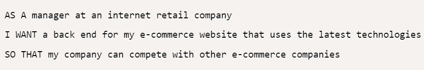
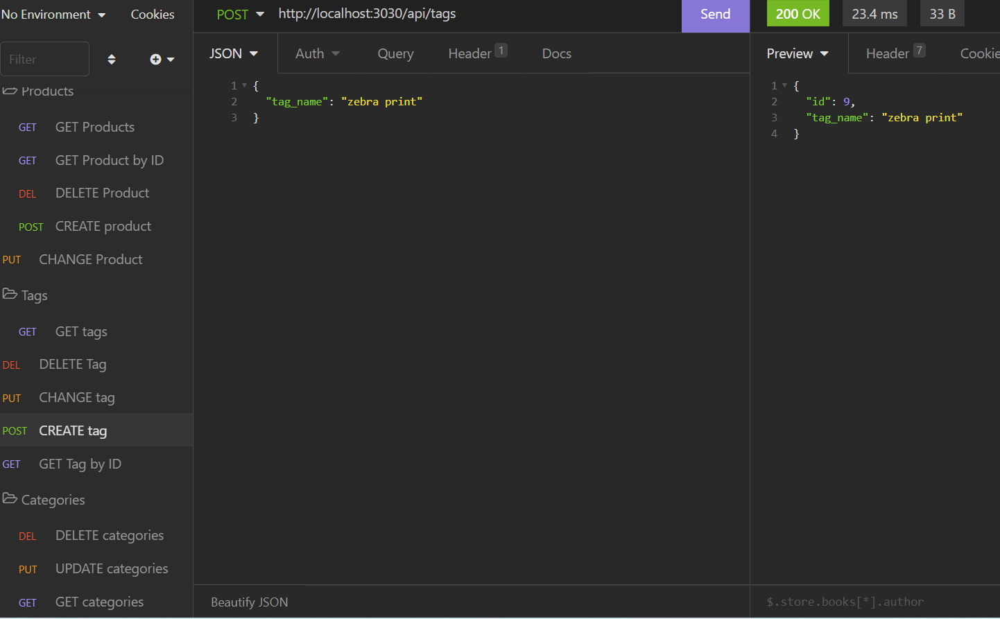

# E-Commerce Back End

  

## Table-of-Contents

  * [Description](#description)
  * [UserStory](#user-story)
  * [Installation](#installation)
  * [Usage](#usage)
  * [License](#license)
  * [Tests](#tests)
  * [Questions](#questions)
  * [Contributers](#contributers)
  

  ## [Description:](#table-of-contents)

  #### This application creates the back end for an e-commerce website. 

  ## [User Story](#user-story)
 
  

  ## [Installation](#table-of-contents)

  #### This application uses express.js and sequelize to interact with mySQL database.

  ## [Usage](#table-of-contents)

  #### This application allows users to add, delete, modify, and view all categories, products, and tags.

* [Click Here](https://drive.google.com/file/d/1QrUjpV95MO7okAbqJkdUqhyApa67fOAr/view) for demonstration video using Insomnia.
* [Click Here](https://drive.google.com/file/d/1l-4ARWjzWppePEHcJzVrAZfwZnhKeNzi/view) for demonstation video using VSCode.

  

  
  ## License
    
  The application is covered under the following license:
    
  
  
    

  ## [Tests](#table-of-contents)

  #### Insomnia

  ## [Questions](#table-of-contents)

  Please contact me using the following links:
  

  * [GitHub](http://github.com/angelagola-ko)

  * [Email: angelagola.ko@gmail.com](mailto:angelagola.ko@gmail.com)

  ## [Contributers](#table-of-contents)

  * Angela Gola &copy;2022 All Rights Reserved.

  